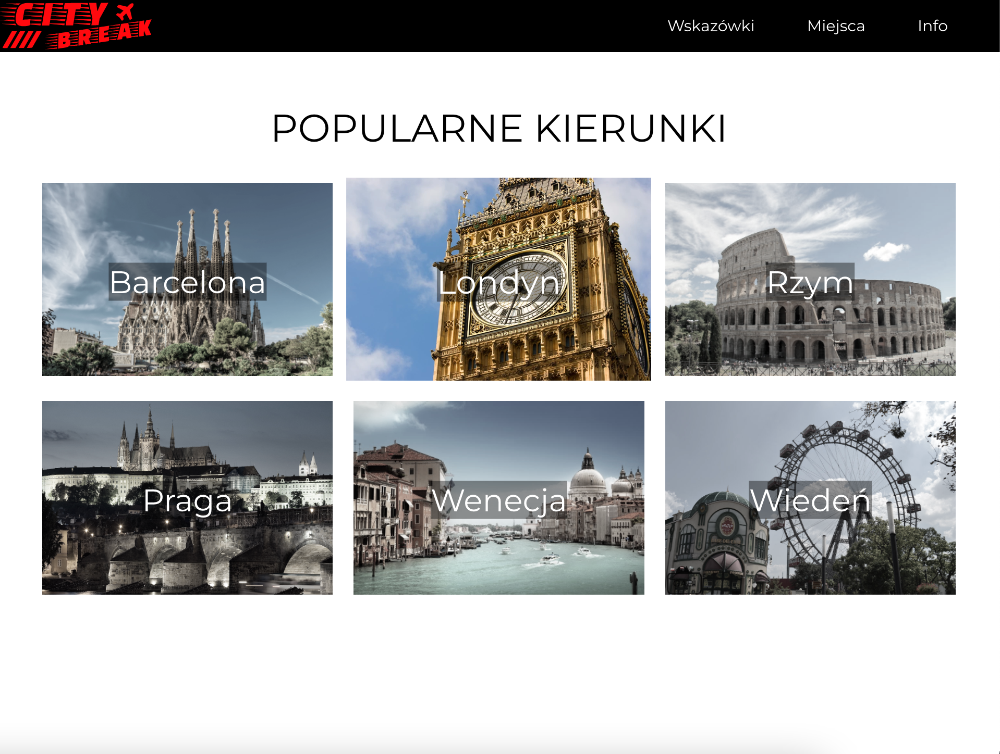
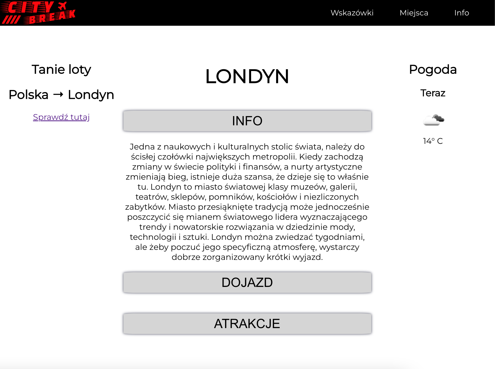

# City break

Prosta aplikacja webowa napisana przy użyciu biblioteki React.

## Demo

Otwórz [http://localhost:3000](http://localhost:3000), aby zobaczyć demo.

## Opis

Strona zawiera inspiracje i informacje pomagające zorganizować krótki weekendowy wyjazd (tzw. city break). 

## Screenshots

 

Z wyglądu strony wyboru miast jestem zadowolony, udało mi się zrobić ładne menu wyboru miasta. Po wyborze miasta przechodzimy na podstronę, która zawiera 3 komponenty, które po kliknięciu rozwijają treść. Po prawej stronie znajduje się informacja o pogodzie, pobierające dane z API OpenWeatherMap. 
